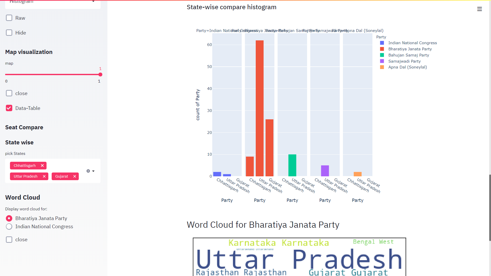

# streamlit-python

## Interactive Dashboards with Streamlit and Python
An interactive dashboard developed with streamlit and python
 
=> Indian general election results-2019 (Winning-Candidates) Data-Set is used for the visualization.

     
     
